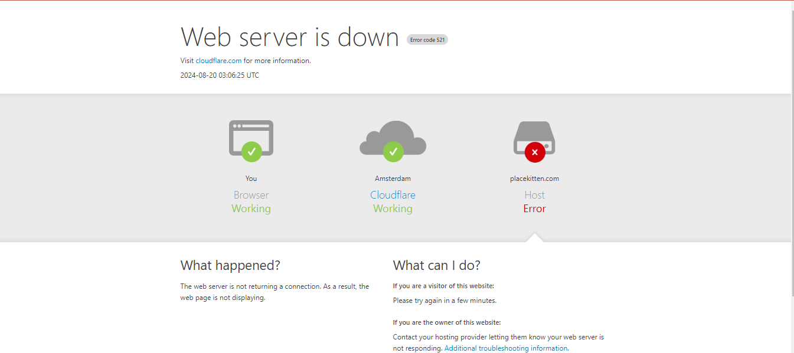

## Issue Summary: The Day the Load Balancer Went Rogue

**Duration of Outage:**  
Start: 2024-08-18, 14:00 UTC  
End: 2024-08-18, 16:30 UTC

**Impact:**  
For 2.5 hours, 85% of our users attempting to access the "Account Overview" feature found themselves in a digital traffic jam, watching the page load like it was stuck in 1995. Some managed to see their account balances after an agonizing wait, while others just stared at a blank screen, perhaps contemplating their life choices.

**Root Cause:**  
Our load balancer decided to play favorites, sending nearly all traffic to just two of our four servers. These servers, unprepared for this sudden popularity, crumbled under the pressure, much like a server room without air conditioning in the summer.

---

### Timeline

- **14:05 UTC** - Our monitoring system started screaming (metaphorically), alerting us that something was very, very wrong with response times.
- **14:10 UTC** - The DevOps team, fueled by caffeine and a sense of impending doom, dove into the application servers to figure out why they were moving slower than a tortoise on a lazy day.
- **14:20 UTC** - Customer Support called in, sounding like they were reporting a natural disaster, “Everything’s slow! The users are not happy!”
- **14:30 UTC** - Engineers decided to blame the database (classic move) and tweaked some caching settings, hoping it would magically fix things. Spoiler: it didn’t.
- **15:00 UTC** - After the database was proven innocent, attention turned to the load balancer, which was found guilty of sending way too much traffic to just two servers.
- **15:15 UTC** - The Networking team was summoned, like the cavalry, to fix the load balancer’s misbehavior.
- **15:45 UTC** - Load balancer got a stern talking to (a configuration update), and traffic was evenly distributed once more.
- **16:00 UTC** - The servers, finally relieved of their burden, returned to their normal, speedy selves.
- **16:30 UTC** - All was calm in the land of the “Account Overview” feature, and users were blissfully unaware of the chaos that had just unfolded.

---

### Root Cause and Resolution: The Misadventures of a Load Balancer

**Root Cause:**  
Our load balancer, normally a reliable and trusted piece of equipment, got a little too creative during a routine update. Instead of sharing the traffic love equally among our four servers, it decided to pile it all onto just two. These two servers, lacking the superhero strength required to handle the load, buckled under pressure, causing delays and frustration for users. Add in an unexpected promotional campaign that brought in more traffic than usual, and you’ve got the perfect storm for an outage.

**Resolution:**  
Once we realized the load balancer was the culprit, the Networking team jumped into action. They corrected the weight distribution, ensuring that all four servers shared the traffic equally. After the adjustment, the servers could finally catch their breath, and the system returned to normal. No servers were harmed in the resolution of this issue (but they did learn their limits).

---

### Corrective and Preventative Measures: How to Keep the Load Balancer in Line

**Improvements and Fixes:**

1. **Load Balancer Configuration Reviews:**
   - From now on, any load balancer update will go through a rigorous review process, including a double-check to make sure no server is getting more than it can handle.

2. **Traffic Monitoring with a Twist:**
   - We’ll be setting up even more detailed traffic monitoring, complete with alerts that are as loud and impossible to ignore as your favorite alarm clock.

3. **Better Marketing-IT Communication:**
   - To avoid future traffic surges taking us by surprise, the Marketing and IT teams will now be best friends (or at least better friends), coordinating on any events that might bring in extra traffic.

**TODO List:**

1. **Patch the Load Balancer:** Make sure it doesn’t get any funny ideas about traffic distribution again.
2. **Deploy Enhanced Monitoring:** Set up alerts that notify us before the servers start feeling the heat.
3. **Run Load Tests:** Because we’re not getting caught off guard again, especially not by a promotional campaign.
4. **Update Documentation:** Write down everything we learned from this incident, so future us can laugh about it and avoid repeating the same mistakes.

---

#### Diagram: The Traffic Jam of 2024

*Above: A simplified diagram showing how the traffic got stuck on two servers while the others sipped virtual cocktails on the beach.*

---

This postmortem was written by **Mark Finley**.